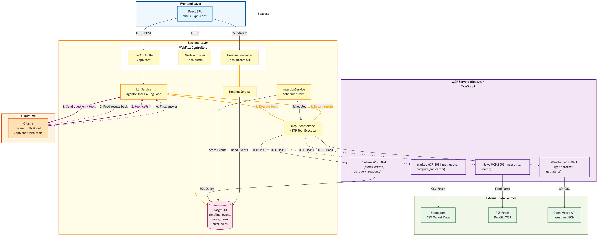

# LiveContext-AI

Real-time intelligence agent correlating market data, news, and weather using MCP (Model Context Protocol) tool-calling with an **agentic LLM loop**.



## 30-Second Overview

LiveContext-AI is an **MCP-first** real-time intelligence platform that:
- Uses **agentic LLM tool-calling** to answer questions with real data
- Fetches market quotes via Market MCP (Stooq)
- Ingests news from RSS feeds via News MCP
- Retrieves weather forecasts via Weather MCP (Open-Meteo)
- Streams timeline updates in real-time via Server-Sent Events (SSE)
- Provides a React dashboard to visualize events and chat with the AI

**Tech Stack:**
- Backend: Java 25 + Spring Boot 4 + WebFlux + Postgres (R2DBC)
- Frontend: Node.js + TypeScript + Vite + React
- MCP Servers: 4 Node.js services (market, news, weather, system)
- AI Runtime: Ollama (qwen2.5:7b model with tool-calling)
- Infrastructure: Docker Compose

## Agentic Tool-Calling Flow


When you ask a question like "Why did TSLA go up today?":

1. **LlmService** sends question + tool definitions to Ollama
2. **Ollama** decides to call `get_quote` tool → MCP fetches from Stooq
3. Tool result is fed back to Ollama
4. **Ollama** decides to call `search_news` tool → MCP searches database
5. Tool result is fed back to Ollama
6. **Ollama** synthesizes final answer with real data
7. Response includes answer + evidence array with source links

## Prerequisites

- Docker & Docker Compose
- (Optional) Java 25 JDK for local development
- (Optional) Node.js LTS for local development

## How to Run

### Quick Start (Docker Compose)

```bash
# Clone the repository
git clone https://github.com/your-org/livecontext-ai.git
cd livecontext-ai

# Start all services
docker compose up -d

# Pull the LLM model (first time only)
docker exec -it livecontext-ollama ollama pull qwen2.5:7b

# View logs
docker compose logs -f backend

# Open in browser
open http://localhost:5173
```

Services will start:
| Service | URL |
|---------|-----|
| Frontend | http://localhost:5173 |
| Backend API | http://localhost:8080 |
| Postgres | localhost:5432 |
| Ollama | http://localhost:11434 |
| Market MCP | internal:8091 |
| News MCP | internal:8092 |
| Weather MCP | internal:8093 |
| System MCP | internal:8094 |

### Using Dev Scripts

**Mac/Linux:**
```bash
./scripts/dev.sh
```

**Windows (PowerShell):**
```powershell
.\scripts\dev.ps1
```

## API Endpoints

| Method | Endpoint | Description |
|--------|----------|-------------|
| POST | `/api/chat` | Ask question → LLM + MCP tools → answer + evidence |
| GET | `/api/stream` | SSE stream of timeline events |
| POST | `/api/alerts` | Create alert rule |
| GET | `/api/alerts` | List alert rules |
| GET | `/api/test/market/{symbol}` | Test market MCP (e.g., AAPL.US) |
| GET | `/api/test/news?query=AI` | Test news MCP search |
| GET | `/api/test/weather` | Test weather MCP |
| GET | `/actuator/health` | Health check |

### Test Endpoints (Developer Debugging)

The `/api/test/*` endpoints are provided by `TestController` for **developer convenience**:

- **Bypass the LLM**: Test MCP tools directly without Ollama processing (faster, no AI overhead)
- **Debug connectivity**: Quickly verify if the backend can reach each MCP server
- **Simple GET requests**: No need to construct complex POST bodies with questions

```bash
# Test market quote directly (bypasses LLM)
curl http://localhost:8080/api/test/market/AAPL.US

# Test news search
curl "http://localhost:8080/api/test/news?query=technology"

# Test weather for Chennai
curl "http://localhost:8080/api/test/weather?latitude=13.0827&longitude=80.2707"
```

> **Note**: These endpoints are for development/debugging only. For production AI-powered queries, use the `/api/chat` endpoint.

## How MCP Servers Work

LiveContext-AI runs **4 independent MCP servers** as separate Node.js processes:

| Server | Port | Tools |
|--------|------|-------|
| Market MCP | 8091 | `get_quote`, `compute_indicators`, `detect_anomaly` |
| News MCP | 8092 | `ingest_rss`, `search`, `analyze_sentiment` |
| Weather MCP | 8093 | `get_forecast`, `get_alerts` |
| System MCP | 8094 | `alerts_create`, `db_query_readonly` |

The Java backend acts as an **MCP client** and calls these tools when:
- The LLM requests them during chat interactions (agentic loop)
- Scheduled ingestion jobs run (market, news, weather polling)

## Architecture

See `docs/architecture.mmd` for a Mermaid diagram and `docs/sequence.puml` for interaction flows.

**Key Components:**
- **LlmService**: Agentic loop that sends questions to Ollama with tool definitions
- **McpClientService**: HTTP client that executes MCP tool calls
- **IngestionService**: Scheduled jobs for market, news, weather ingestion
- **TimelineService**: Streams events to frontend via SSE

## Adding New Tools/Providers

### Adding a New MCP Tool

1. Add tool schema in the appropriate MCP server (`mcp/{server}/src/tools/`)
2. Implement the tool handler with input validation and logging
3. Register the tool in the server's `index.ts`
4. Update `LlmService.java` to add tool definition in `buildToolDefinitions()`
5. Update `LlmService.java` to handle the tool in `executeToolByName()`
6. Restart the MCP server and backend

### Swapping Data Providers

**Market Data:**
- Default: Stooq (keyless, public)
- Option: Alpha Vantage (requires `ALPHAVANTAGE_API_KEY`)
- Interface: `MarketDataProvider.java`
- Implementation: `StooqMarketDataProvider.java`

**News Data:**
- Default: RSS feeds (configured in `application.yml`)
- Edit `livecontext.ingestion.news.feeds` (comma-separated URLs)

**Weather Data:**
- Default: Open-Meteo (keyless, public)
- Implementation: `weather-mcp/src/tools/getForecast.ts`

## Configuration

Edit `backend/src/main/resources/application.yml`:

```yaml
livecontext:
  ollama:
    base-url: http://localhost:11434
    model: qwen2.5:7b       # Tool-calling capable model
    
  ingestion:
    market:
      symbols: AAPL.US,TSLA.US,GOOGL.US  # Comma-separated
      cron: "0 */1 * * * *"              # Every minute
    news:
      feeds: https://reddit.com/r/artificial/.rss,https://feeds.a.dj.com/rss/RSSMarketsMain.xml
      cron: "0 */5 * * * *"              # Every 5 minutes
    weather:
      cron: "0 */15 * * * *"             # Every 15 minutes
```

## Public Data Usage & Legal Notes

**Important:** This project uses only public, keyless data sources by default:
- **Market Data**: Stooq (https://stooq.com) - free historical and current data
- **News Data**: RSS feeds (Reddit, Wall Street Journal, etc.)
- **Weather Data**: Open-Meteo (https://open-meteo.com) - public weather API

**User Responsibilities:**
- Data is fetched for educational and demonstrative purposes only
- Users are responsible for verifying compliance with each provider's terms of service
- No data is redistributed or sold by this project
- Respect rate limits and robots.txt of all data sources

## Testing

### Backend Tests (JUnit + JaCoCo)

```bash
cd backend
./gradlew test                        # Run all tests
./gradlew jacocoTestReport            # Generate coverage report (build/reports/jacoco)
./gradlew jacocoTestCoverageVerification  # Verify 70% coverage threshold
```

### Frontend Tests (Vitest)

```bash
cd frontend
npm test                    # Run tests in watch mode
npm run test:coverage       # Run with coverage report
npm run test:ui             # Open Vitest UI
```

### MCP Server Tests (Jest)

```bash
cd mcp/market-mcp && npm test         # Market MCP (getQuote, computeIndicators, detectAnomaly)
cd mcp/news-mcp && npm test           # News MCP (ingestRss, search, analyzeSentiment)
cd mcp/weather-mcp && npm test        # Weather MCP (getForecast, getAlerts)
cd mcp/system-mcp && npm test         # System MCP (alertsCreate, dbQueryReadonly)
cd mcp/shared && npm test             # Shared utilities (logger, validator)
```

### API Integration Tests

```bash
# Test the chat API
curl -X POST http://localhost:8080/api/chat \
  -H "Content-Type: application/json" \
  -d '{"question": "What is the current price of AAPL stock?"}'

# Test MCP tools directly
curl http://localhost:8080/api/test/market/AAPL.US
curl http://localhost:8080/api/test/news?query=AI
curl http://localhost:8080/api/test/weather
```

## Formatting (Java)

```bash
cd backend
./gradlew spotlessApply    # Auto-format
./gradlew spotlessCheck    # Check formatting (CI)
```

## CI/CD

GitHub Actions workflow (`.github/workflows/build.yml`) runs on every push:
- **Backend**: Java build + JUnit tests + Spotless formatting check
- **Frontend**: npm install + Vite build + lint
- **MCP Servers**: Builds all 4 MCP servers (market, news, weather, system)

## Project Structure

```
backend/          - Java 25 Spring Boot WebFlux API
  └── service/
      ├── LlmService.java       - Agentic tool-calling loop
      ├── McpClientService.java - MCP HTTP client
      └── IngestionService.java - Scheduled jobs
frontend/         - React TypeScript SPA
mcp/              - 4 MCP servers + shared libs
scripts/          - Dev startup scripts
docs/             - Architecture diagrams (mmd, puml, png)
.github/          - CI/CD workflows
```

## Troubleshooting

**LLM not calling tools:**
- Ensure model supports tool-calling (qwen2.5:7b, llama3.1)
- Check logs for `[llm_tool_calls_detected]`

**MCP 400 Bad Request:**
- Check logs for `[mcp_tool_call_start]` to see request body
- Verify comma-separated config in application.yml

**Database errors:**
- Tables use TEXT columns, not JSONB (R2DBC compatibility)
- Run `docker exec livecontext-postgres psql -U livecontext -d livecontext -c "\dt"`

**Empty ingestion (symbolCount=0):**
- Use comma-separated strings in YAML, not list format

## License

MIT License - see LICENSE file

## Contributing

Contributions welcome! Please:
1. Follow Google Java Format (enforced via Spotless)
2. Add tests for new features
3. Update documentation
4. Ensure CI passes

---

**Built with MCP-first architecture and agentic LLM tool-calling for maximum extensibility.**
