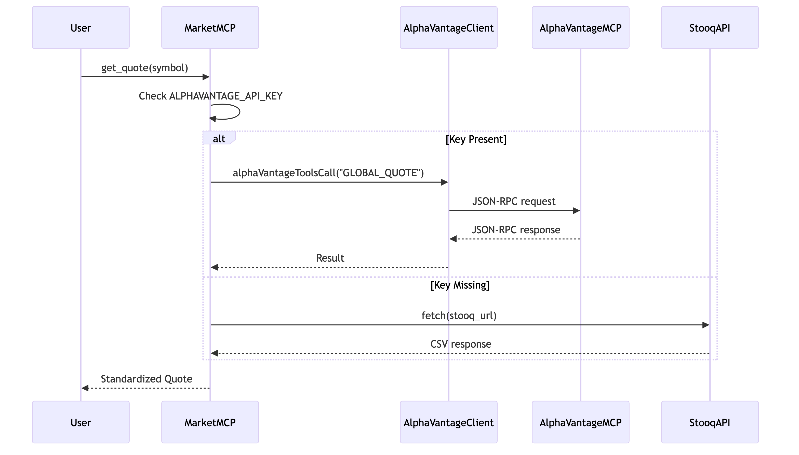
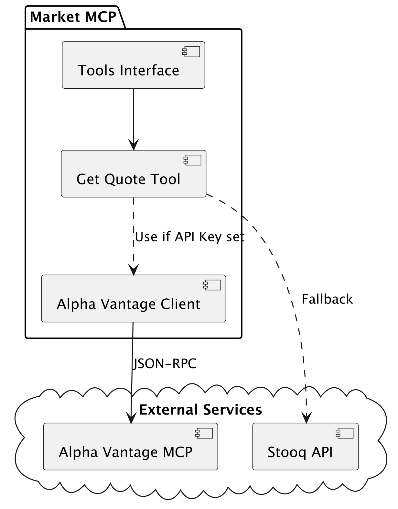

# Market MCP Service

This service provides market data tools via the Model Context Protocol (MCP).

## Architecture

### Sequence Diagram


### Component Diagram


## Tools

### `get_quote`
Fetches the current price and change information for a given stock symbol.

- **Parameters**:
  - `symbol` (string): The stock ticker symbol (e.g., "IBM", "AAPL").
  - `interval` (string, optional): The data interval (e.g., "daily"). Default is "daily".

- **Providers**:
  1. **Alpha Vantage**: Used if `ALPHAVANTAGE_API_KEY` is set. Provides reliable data with higher rate limits (depending on plan).
  2. **Stooq**: Fallback provider. Free but has lower rate limits and less detailed data.

### `compute_indicators`
(*Implementation details...*)

### `detect_anomaly`
(*Implementation details...*)

## Configuration

To use the Alpha Vantage provider, you must set the `ALPHAVANTAGE_API_KEY` environment variable.

```bash
export ALPHAVANTAGE_API_KEY=your_api_key
```

If this variable is not set, the service defaults to Stooq.

## Development

### Build
```bash
npm run build
```

### Run
```bash
npm run start
```

### Test
```bash
npm test
```
